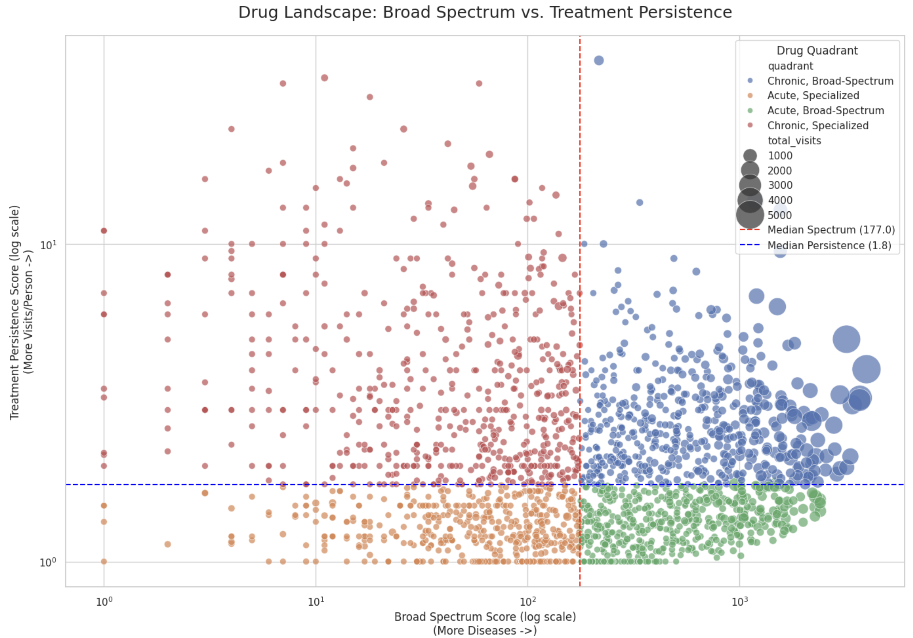
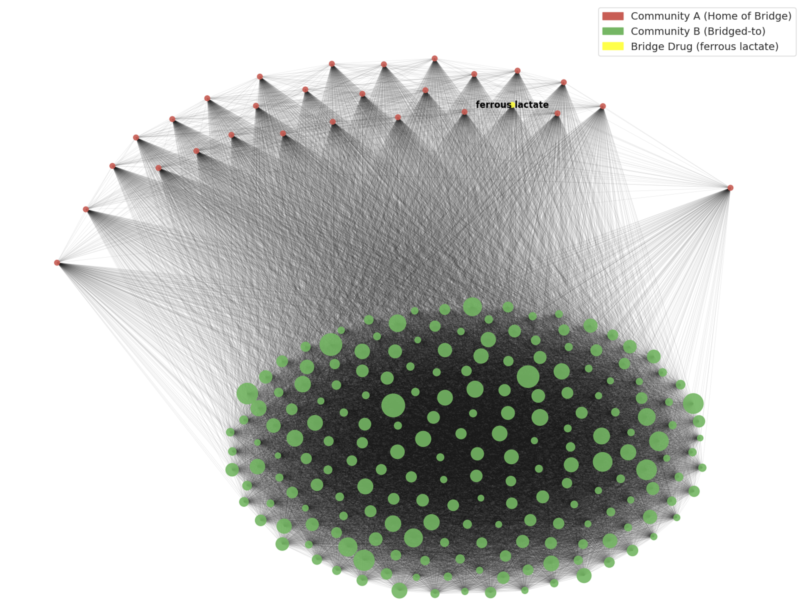

# EHR Network Analysis for Drug Role Discovery


This repository contains the code and analysis for the "Uncovering Clinical Patterns with Network Analysis" project. The primary goal is to classify the functional roles of pharmaceuticals (e.g., acute vs. chronic care) based on their topological position within a large-scale heterogeneous clinical graph built from the EHRShot dataset.

## Key Research Findings

This analysis successfully demonstrates that network topology can serve as a powerful proxy for a drug's clinical function.

### 1. Quadrant-Based Drug Classification

By defining two novel topological metrics—**"Broad Spectrum"** (number of diseases treated) and **"Treatment Persistence"** (visits-per-patient ratio)—we can effectively classify drugs into four distinct functional quadrants:

1.  **Chronic, Broad-Spectrum (Top-Right):** Foundational hospital drugs (e.g., Saline).
2.  **Chronic, Specialized (Top-Left):** Long-term, targeted treatments (e.g., Chemotherapy).
3.  **Acute, Broad-Spectrum (Bottom-Right):** Single-use, procedural drugs (e.g., Anesthetics).
4.  **Acute, Specialized (Bottom-Left):** Specialized, one-time treatments (e.g., Topical clotting agents).



### 2. "Bridging" Drugs as Comorbidity Markers

Using a drug-drug co-treatment graph and **Betweenness Centrality**, we identified that the most critical "bridging" drugs are not complex pharmaceuticals but common comorbidity supplements, specifically **iron (`ferrous lactate`)** and **calcium**.

These drugs act as structural bridges connecting disparate disease communities (e.g., linking the "kidney disease" drug cluster with the "cancer drug" cluster), highlighting their role in treating widespread concurrent conditions like anemia.



## Methodology

The project follows a multi-stage network analysis pipeline:

1.  **Heterogeneous Graph Construction:** A graph is built using `PyTorch Geometric (PyG)` with five node types: `Person`, `Visit`, `Disease`, `Drug`, and `Symptom`. All relations are mediated by the `Visit` node.
2.  **Metric Definition:** The `Broad Spectrum (BS)` and `Treatment Persistence (TP)` scores are calculated for all `Drug` nodes based on their 2-hop neighborhoods.
3.  **Homogeneous Graph Construction:** A weighted `Drug-Drug` graph is created using `NetworkX`. The edge weight between two drugs is the **Jaccard Similarity** of the disease sets they are prescribed for.
4.  **Centrality & Community Analysis:** `Betweenness Centrality` is calculated on the Drug-Drug graph to find "bridging" nodes. The `Louvain` algorithm is used to detect drug communities for visualization.

## Setup and Execution

### Prerequisites

* Python 3.8+
* Pandas
* PyTorch
* PyTorch Geometric (PyG)
* NetworkX
* Matplotlib
* Seaborn
* PyVis (for interactive graphs)

### Installation

1.  Clone the repository:
    ```bash
    git clone git@github.com:VanDinhLe/GraphML.git
    ```

2.  Install the required packages:
    ```bash
    pip install -r requirements.txt
    ```

### Running the Analysis

1.  **Data:** Place the EHRShot dataset (all `.csv` files) into a `/data/` directory at the root of this project. (Note: The dataset is not included in this repository).

2.  **Execute:** Run the main analysis script or Jupyter notebook.
    ```bash
    python main_analysis.py
    ```
    *or*
    ```bash
    jupyter notebook Analysis.ipynb
    ```

## License

This project is licensed under the MIT License - see the `LICENSE` file for details.